# Take Control of the Data of You

Over the last four years I have been collecting my personal health data from a variety of wearable devices. I'm going to demonstrate my current set up and share the code that I have written with Azure Functions, Azure Cosmos DB, Azure ML Studio, the Microsoft Bot Framework, LUIS.ai and Power BI. I normally work in C# but I chose to use node.js for this project as a learning opportunity. There are many opportunities to improve the quality of my javascript code but I have included it here for purpose of demonstration to accompany a recent talk on this subject that I gave at NDC Oslo. If you are a garmin user (that captures active heart rate data) you should be able to follow these instructions and build out this solution for youself using your own data. If you do so I'm really interested in [getting your feedback](http://twitter.com/nzigel) on how it works.<br><br>[](https://vimeo.com/223984825)

## Background
There is a lot of value in the health data that you collect from wearable devices. With enough data you can gain insight like predicting when you might be getting sick and be warned beforehand so that you can make changes to avoid the event. You can also ask questions of your data like what was your resting heart rate last month and how much exercise you have been getting. The data that you are collecting from wearables is your data and I'm going to show you how I collect it and make it work for me.

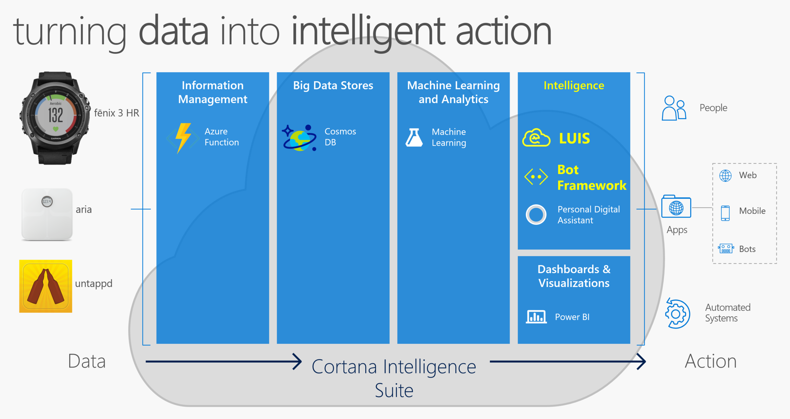

## Extract your Data to Train a Machine Learning Model - Garmin
The first step here assumes that you are using a Garmin wearable device and have collected a reasonable amount of data. In my experience having daily/ resting heart rate data available really makes a difference here. If you have data in another ecosystem you will need to research how to extract the data. To get to the data out of Garmin perform the following steps.

1. Navigate to https://connect.garmin.com/modern/proxy/userstats-service/wellness/daily/[username]?fromDate=yyyy-mm-dd&untilDate=yyyy-mm-dd. Replace the date range to include all the data you have been collecting and change the username with your Garmin username. You will need to first log in to https://connect.garmin.com/modern with your garmin account before this will work.

2. Load the .json file into Excel 

    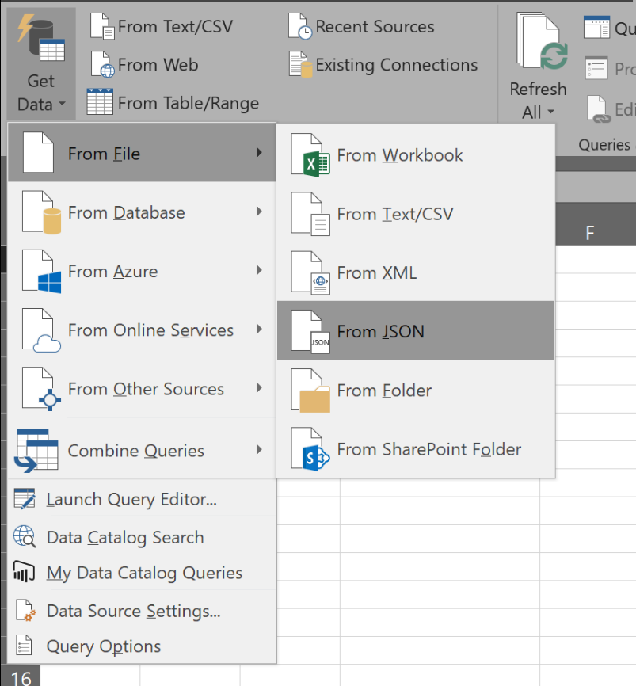<br>

    Click allMetrics Record to expand the record

    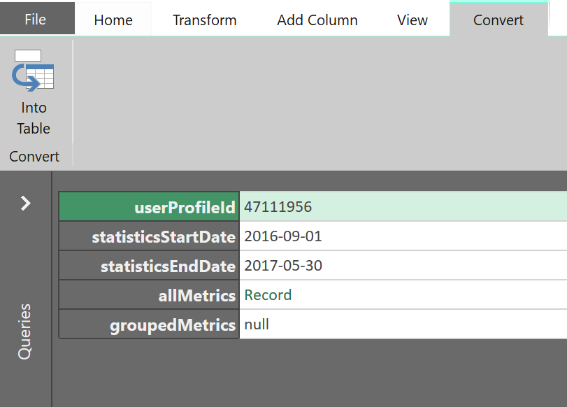<br>

    Click metricsMap Record to expand the record

    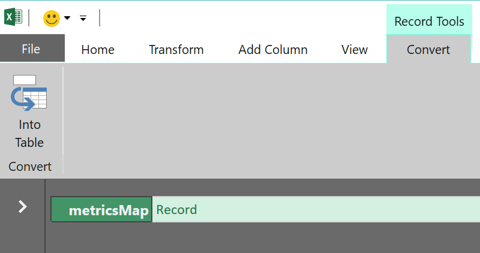<br>

    Click Into Table

    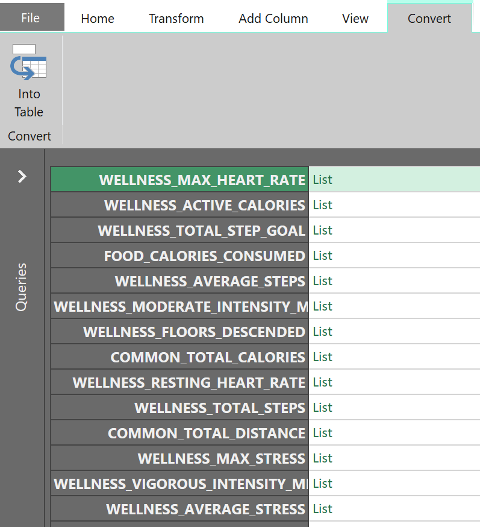<br>

    Expand next to Value Expand to New Rows

    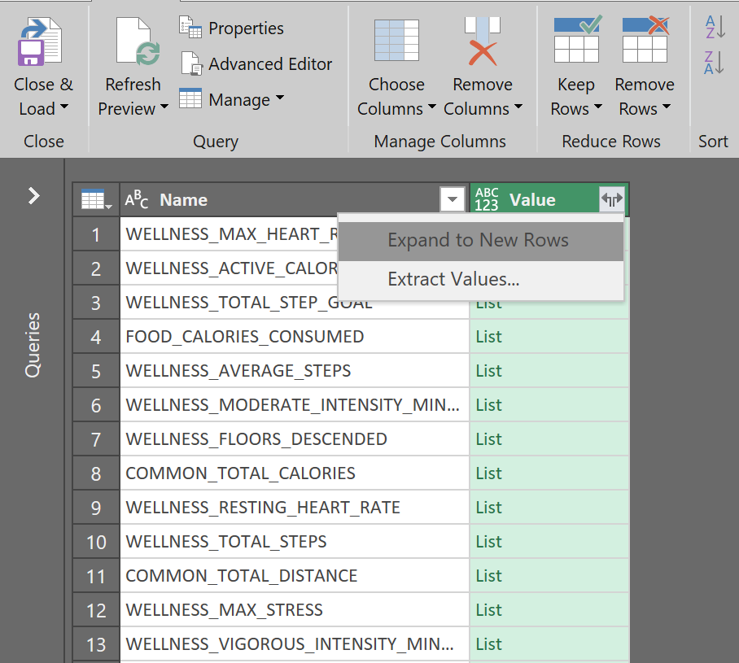<br>

    Click OK

    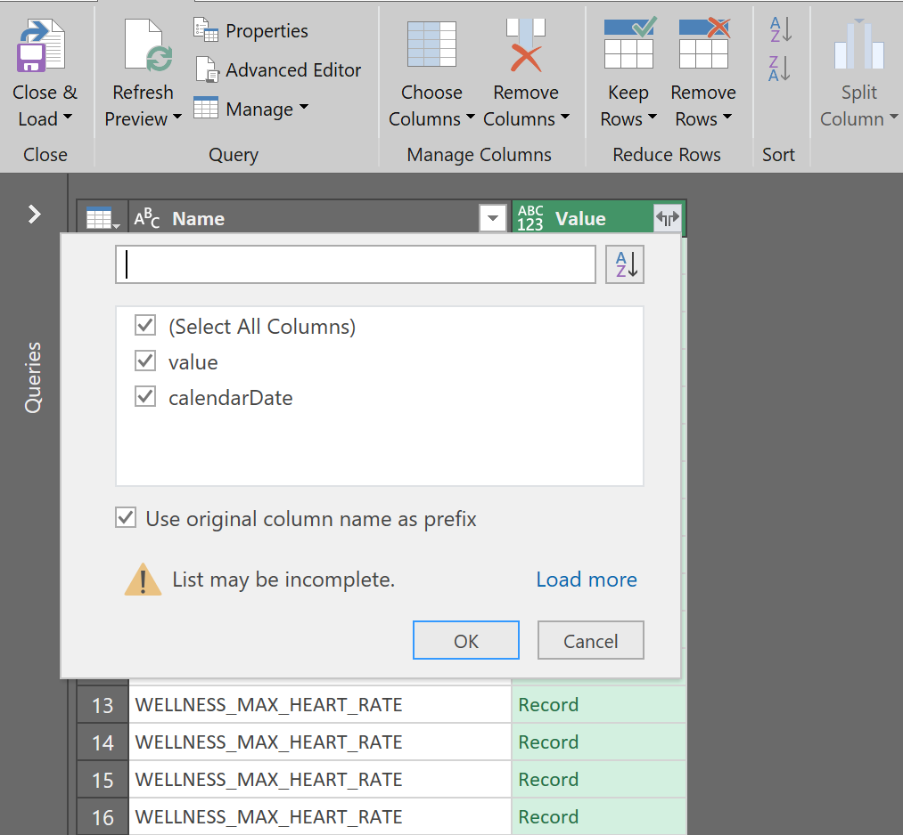<br>

    Close and Load

    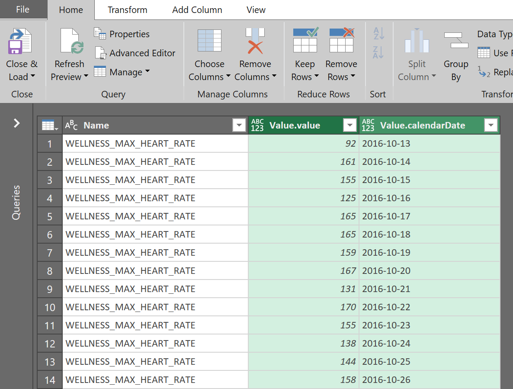<br>

    Create a Pivot Table to transpose the columns

    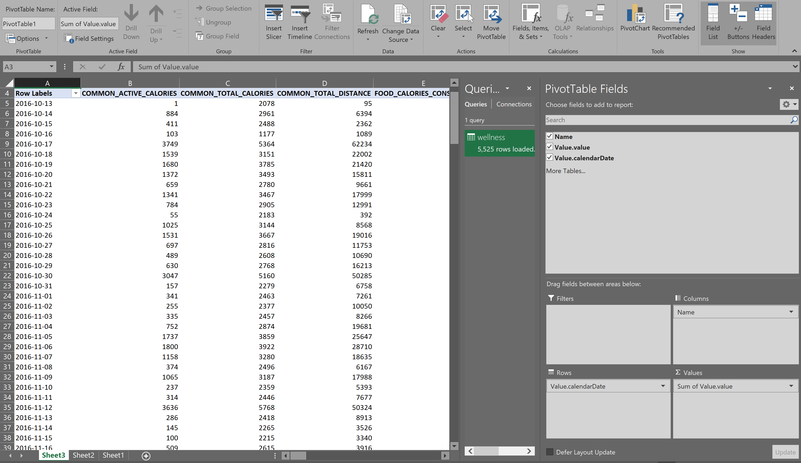<br>

    Extract the columns with values into a table

    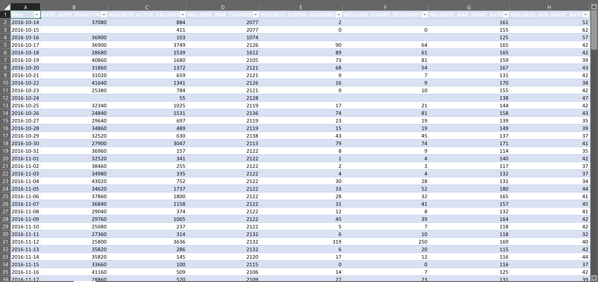<br>

    Now the ideal requirement here is that you have logged the days that you have been sick so that you can flag them in the dataset in order to train the model successfully. Now since I have done this and you may not have I have made [two years of my data available in CSV format](./sampleData/garminExport.csv) for you to train your model from. Since this is from my data and not your data the average resting heart rate data is probably not a match for yours meaning that the model will be less effective for you. Alternatively look into your data to see days where you have the highest resting heart rate, if any of these days are consecutive days there is a good chance that you were sick on these days and you can flag those as sick days accordingly. In my case I have found that high intensity exercise, alcohol and caffeine raise my resting heart rate. I no longer have caffeine and I log my alcohol consumption using the http://untappd.com app this is also an input into my data that forms part of my model. 

3. Clean the data in Excel - replace all missing values with 0 with the exception of missing values for SLEEP_SLEEP_DURATION - missing values here you can either remove that line in your data or replace with an average value based on the surrounding data. 

    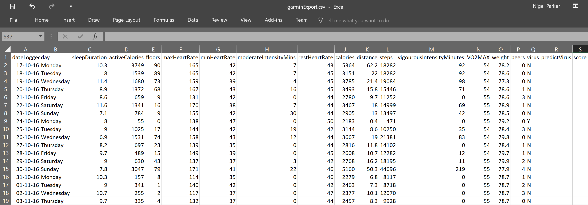<br>

Here I update the column names so that when I load them into DocumentDB they form the object names that make sense to me. I also bring in other data sources here as well. I get VO2MAX from my activity feed https://connect.garmin.com/modern/proxy/userstats-service/activities/all/[username]?fromDate=yyyy-mm-dd&untilDate=yyyy-mm-dd and import it in a similar way to what I describe above. I also bring my weight data from the fitbit aria scales into garmin via My Fitness Pal. 

The column names that I have created in my CSV are as follows translated from the ones in the pivot table.

``` javascript
    dateLogged
    day             // calculated as day of week from dateLogged
    sleepDuration   // calculated from secs to hours by dividing SLEEP_SLEEP_DURATION by (60*60)
    activeCalories  // WELLNESS_ACTIVE_CALORIES
    floors          // WELLNESS_FLOORS_ASCENDED
    maxHeartRate    // WELLNESS_MAX_HEART_RATE
    minHeartRate    // WELLNESS_MIN_HEART_RATE
    moderateIntensityMins // WELLNESS_MODERATE_INTENSITY_MINUTES
    restHeartRate   // WELLNESS_RESTING_HEART_RATE
    calories        // WELLNESS_TOTAL_CALORIES
    distance        // calculated in KM by dividing WELLNESS_TOTAL_DISTANCE metres by 1000
    steps           // WELLNESS_TOTAL_STEPS
    vigourousIntensityMinutes //WELLNESS_VIGOROUS_INTENSITY_MINUTES
    VO2MAX          // From my garmin activity data - assumed previous day value until a new value is logged
    weight          // From garmin linked through My Fitness Pal from my Fitbit scales
    beers           // This comes from untappd and is a tally of my daily beer consumption
    virus           // Added by me identfying which days I was sick as a label
    predictVirus    // Added by me as a blank column for later as a response from the ML predicition service
    score           // Added by me as a blank column for later as a response from the ML predicition service
```

## Training the Machine Learning Model from the Data

Now that you have extracted a workable dataset of your data ([or you have my CSV file](./sampleData/garminExport.csv)) you are ready to train the machine learning model. The model is gets better the more data you have I generally retrain my model every couple of months or after periods where I am sick. To understand which algorthims to select I recommend that you check out the Microsoft Azure Machine Learning: Algorithm Cheat Sheet ([aka.ms/MLCheatSheet](http://aka.ms/MLCheatSheet)). I have [published my trained model](https://gallery.cortanaintelligence.com/Experiment/Virus-Predictor) and [my training model](https://gallery.cortanaintelligence.com/Experiment/Virus-Predictor-Training-Model) to the gallery so you can use those. One thing to be aware of is that if you publish my trained model and use it against your data you will likely get false positive warnings about viruses unless your resting heart rate is very similar to my own. I highly recommend retraining this model with an export of your data.

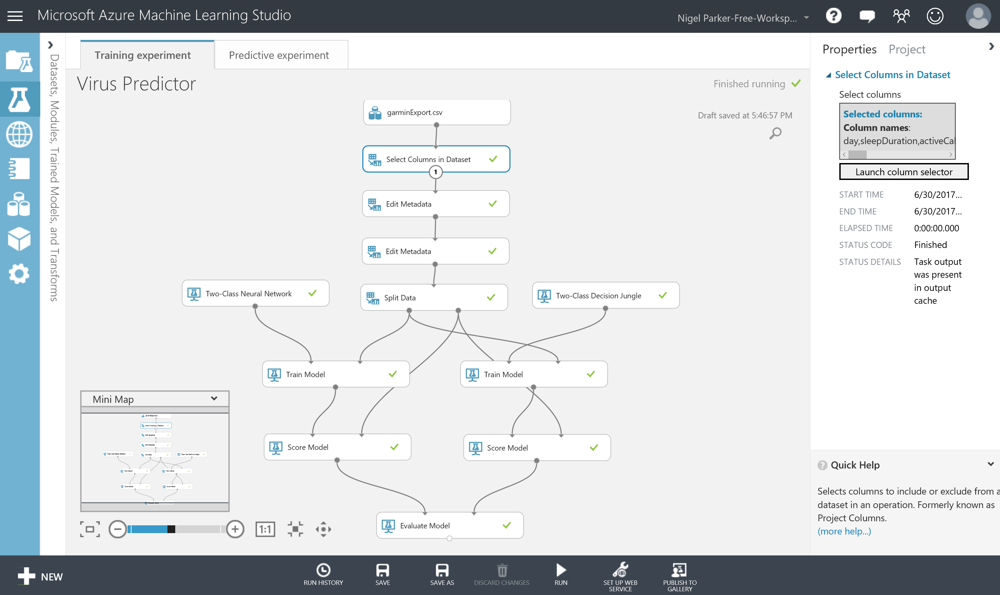<br>

1. Select Columns in Dataset - I chose a subset of my columns. I got rid of distance as it correlated perfectly to steps. I got rid of floorsDown as correlated mostly to floors. I got rid of VO2MAX as it is linked to exercise and it's slow to go up and down. I also got rid of maxHeartRate as it is a point event based on exercise and I figured that vigourousIntensityMinutes is a better read on this value. I also didn't include weight as I found daily weight data isn't very useful due to small fluxtuations in weight affected by the time of the day and whether I was measuring before or after exercise. I questioned whether I should remove the date column or not. Often sickness happens over consecutive days and the build up of resting heart rate, exercise and/or beer consumption from previous days can contribute to a prediction on future days. My rational for removing date came after I tried a regression model including the date and tried anomaly detection. Neither technique yielded as strong results as when I set virus as a binary (sick or not) two class classifier. In practice I still get the benefit of an early warning system where my model will predict virus will a low percentage of certainty or not virus with a high level of uncertainty prior to me getting sick when I'm rundown or my body starts fighting a virus. At this point I get notified and can make choices to slow down and avoid getting sick you'll see this in some of the data that I share below. I have included day of the week in the model as I think it is relevant. I am generally more rundown at a certain stages of the week and I know I generally drink more beer and exercise for longer periods on a Saturday so I thought that may play into the model.

    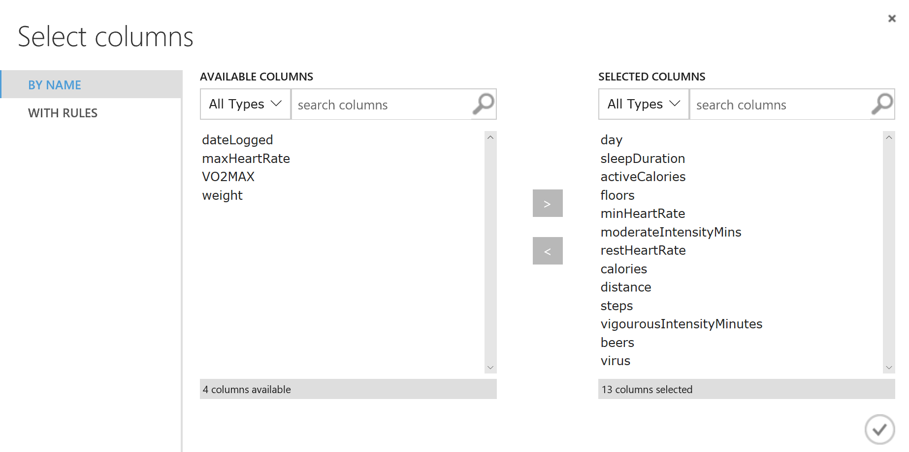

2. Edit Metadata - I need to make both Virus and Day categorical as both are text fields and I need them set as categories so that they are analysed properly.

    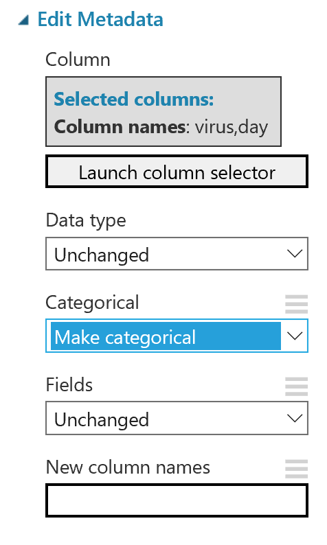<br>

3. Edit Metadata - set label on Virus as this is field I am trying to calculate from my data.

    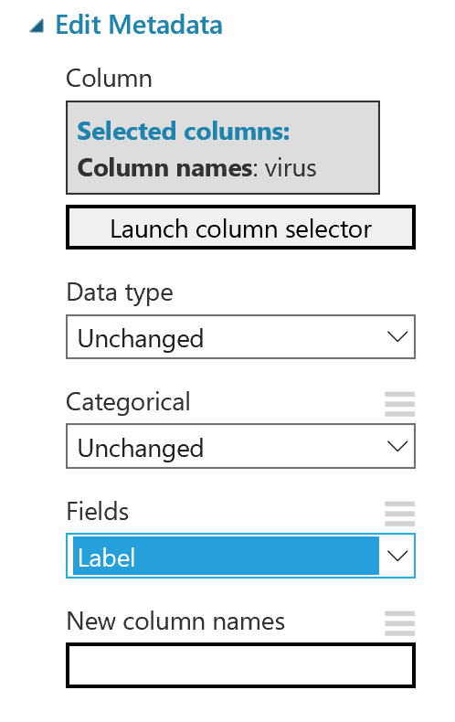<br>

4. Split Data - it is important to split the data to train the model with a portion of your data and score it with the rest. When there aren't many examples of positive virus in the data you need to make sure that you use a stratified split to ensure that there are positive examples in both the training and testing data.

    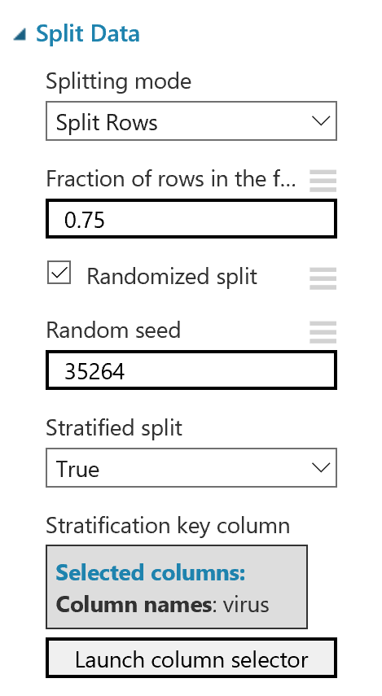<br>

5. Train Model - This is where you choose your algorithm for two class classification and select Virus as the label column. I tried a few of the two class classification algorithms against my data and found that I got the best results from the two class decision jungle.

    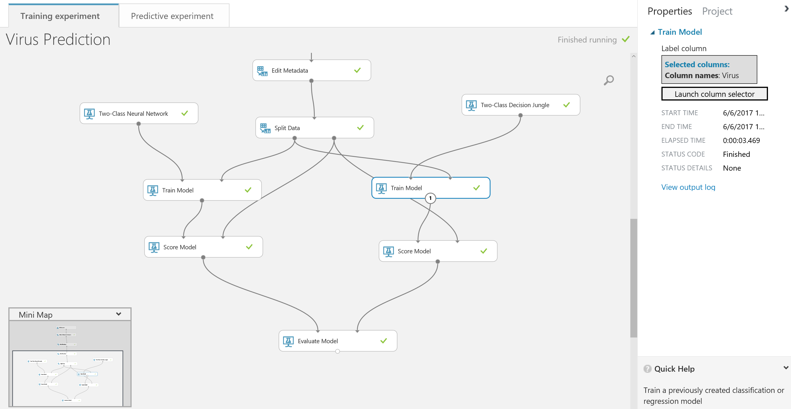<br>

6. Select the best algorithm to deploy as a web service.Scored dataset is the one on the left of the model in our case this is the two class neural network and the one marked in red is the one on the right the two class decision jungle. Looking at both charts and matches for true and false positives I have chosen to publish the web site with the two class neural network as it is performing better with our data.

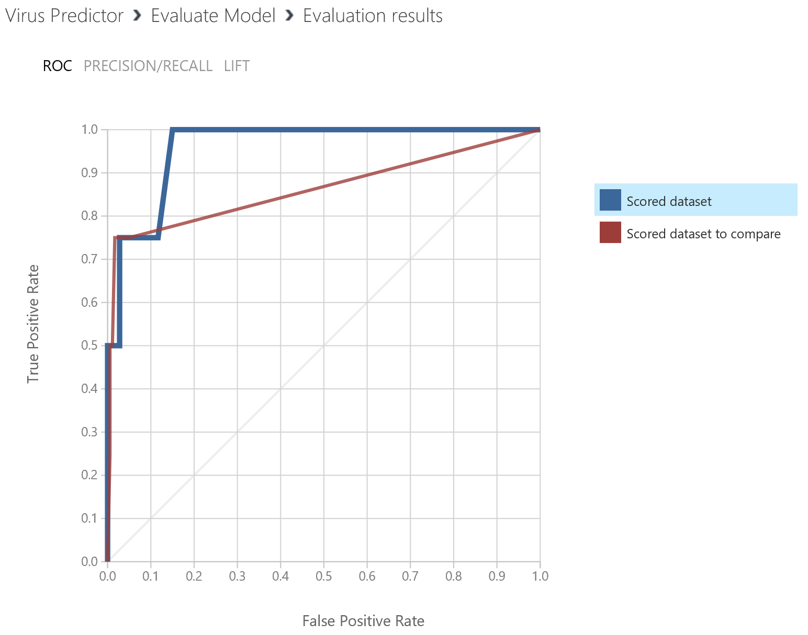<br>

7. Publish the model as a web service - once the model has been trained you can select the algorthim that performs best and publish that as a web service that you can call from within your application. The way to interpret the response from the web service is that you will pass into it daily data and it will return with a scored label and a scored probability. In the example below the model is predicting with 70.7% probability that I do have a virus. Often the scored label will be N and the scored probability will be very low. This means anything below 0.5 (or 50%) scored probability is considered no virus and the smaller the number the higher the confidence of the model. E.g. a scored label of 'N' and a scored probability of 0.48 means that the model is close to switching from N to Y in the Virus predicition.

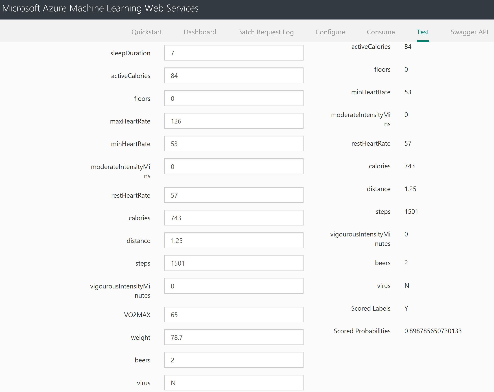<br>

### Batch Process Virus Prediction
Batch process the CSV file against the published Azure ML web service can be done to create a predictVirus and score column in your CSV this can be done after you publish your model as a web service.

1. Log into [https://studio.azureml.net](https://studio.azureml.net) and test your web service using 'Batch Execution' - Excel 2013 or later workbook<br>
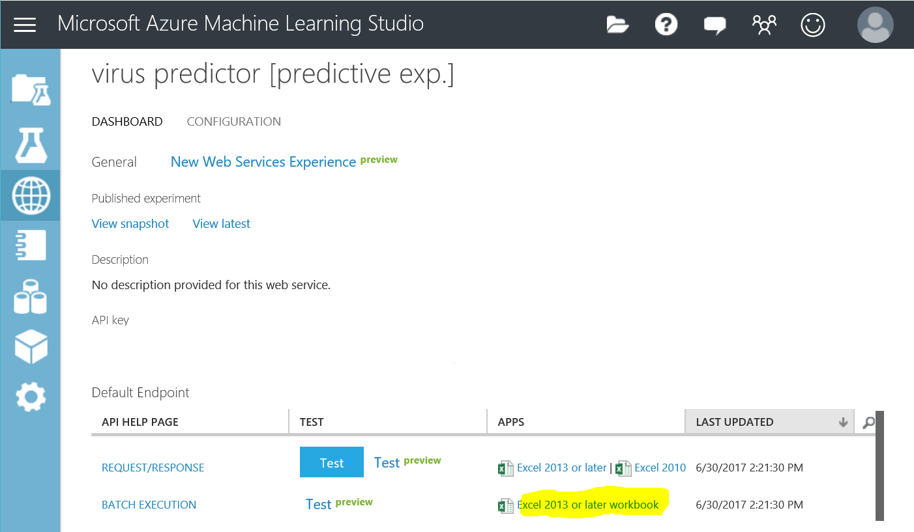<br>
2. In the top right column click on your webservice and click use sample data then select the table that was inserted. Create a second Sheet2 for the data to be written to. Replace the sample data with data from [garminExportUnscored.csv](./sampleData/garminExportUnscored.csv) or the csv data that you exported earlier to use to train your model.

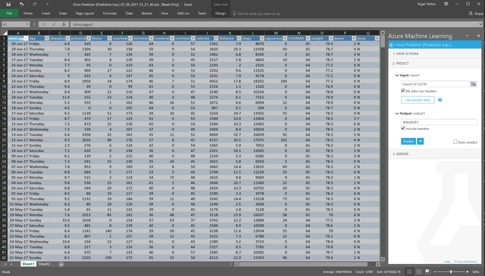<br>

If you are creating your own CSV file load the Scored Labels and Scored Probabilities column data into the predictVirus and score column before you update the CSV to document DB in the next step.

## Database Setup - Cosmos DB - Document DB 
By storing the daily health data in Cosmos DB / Document DB I am able to access the data from both Power BI/ Cortana and from the Microsoft Bot Framework. When I first set this up I used Azure Search as a layer over the Document DB for the bot to talk to. ([Check this sample on how to do this.](https://github.com/ryanvolum/AzureSearchBot)) After I had this setup and working I realised that I was making the solution more complex than it needed to be. I wasn't using facet search as the natural language used to ask questions of the bot was being interpreted by LUIS.ai and turned into search query strings that returned calculated data like average, max and counts of data. Since Azure search wasn't able to perform these caluclations directly in queries I was performing the calculations in code inside the bot. I realised that this wasn't the most effective way to approach the problem so I refactored the code in the bot to talk directly to the Document DB. I use LUIS.ai to help with the query creation back to the database with the built in DateTimeV2 entity handling most of the date processing.

### Create a Document DB database and collection. 
1. Navigate to Databases Azure Cosmos DB in the Azure Portal and create a new Document DB

    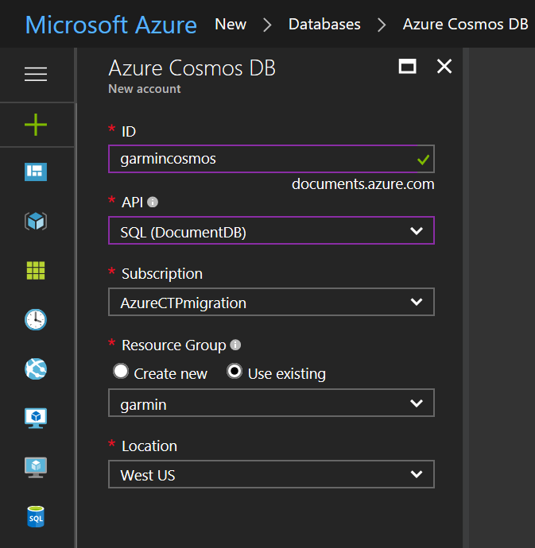
                                  
2. Click 'Add Collection' in the Document DB settings window

    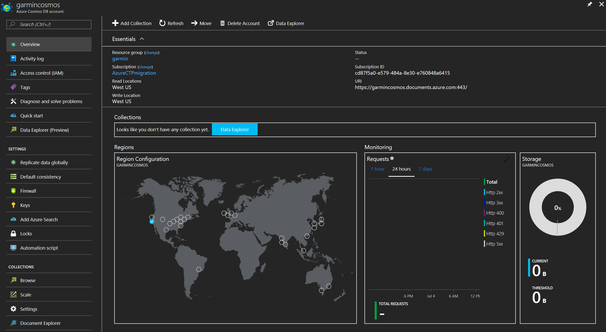

3. Create a new collection 'garminData' and database 'db' - I have reduced the initial throughput capacity to 400 RU/s as a minimum as this is more than enough to meet my needs.

    


### Upload CSV data
Now that we've got our database and collection set up, let's go ahead and push our csv data up. This can be done programatically, but for the sake of simplicity I'm going to use the [Document DB Data Migration Tool](https://azure.microsoft.com/en-us/documentation/articles/documentdb-import-data/).

1. Once you've got the tool, navigate to the [garminExport.csv file](./sampleData/garminExport.csv): 

    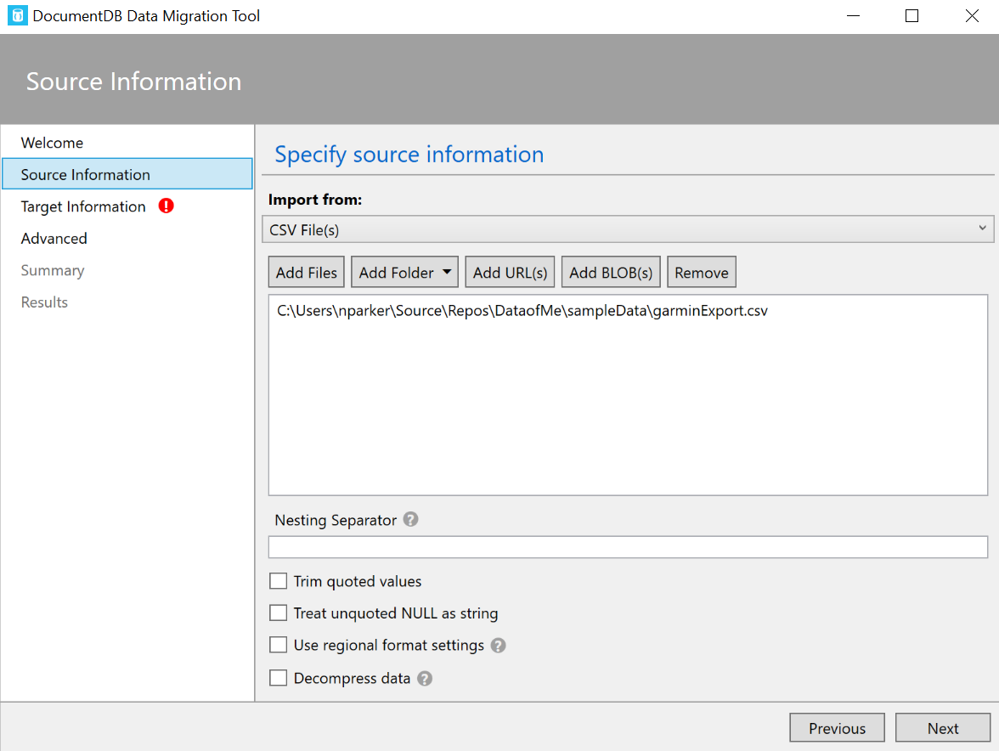

2. Fill in target information

    1. Get connection strings from portal

        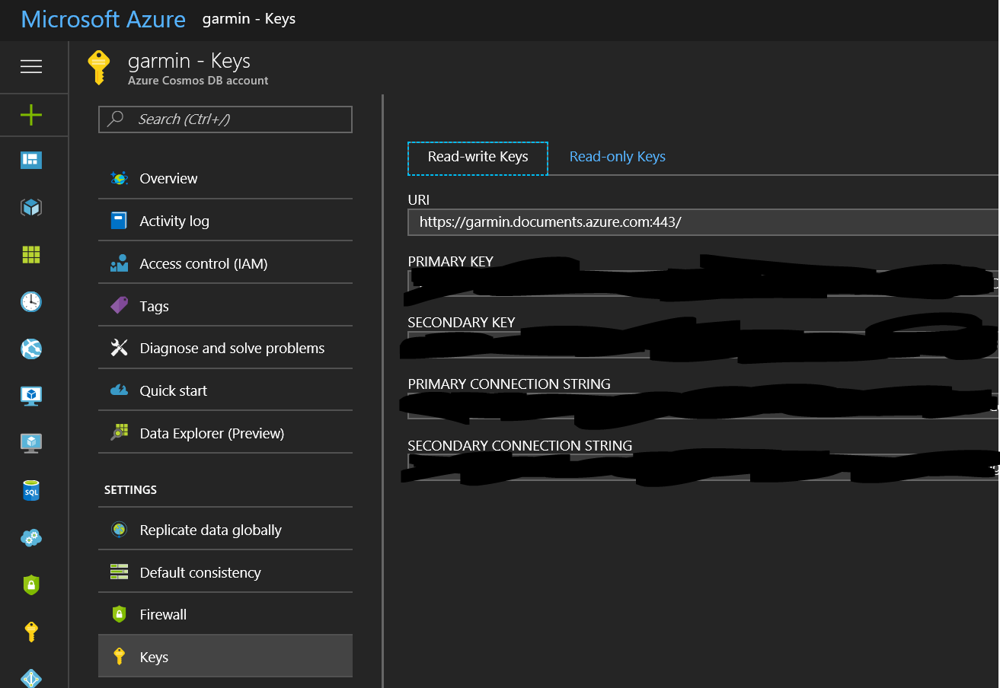

    2. Be sure to add Database = db; to your connection string

        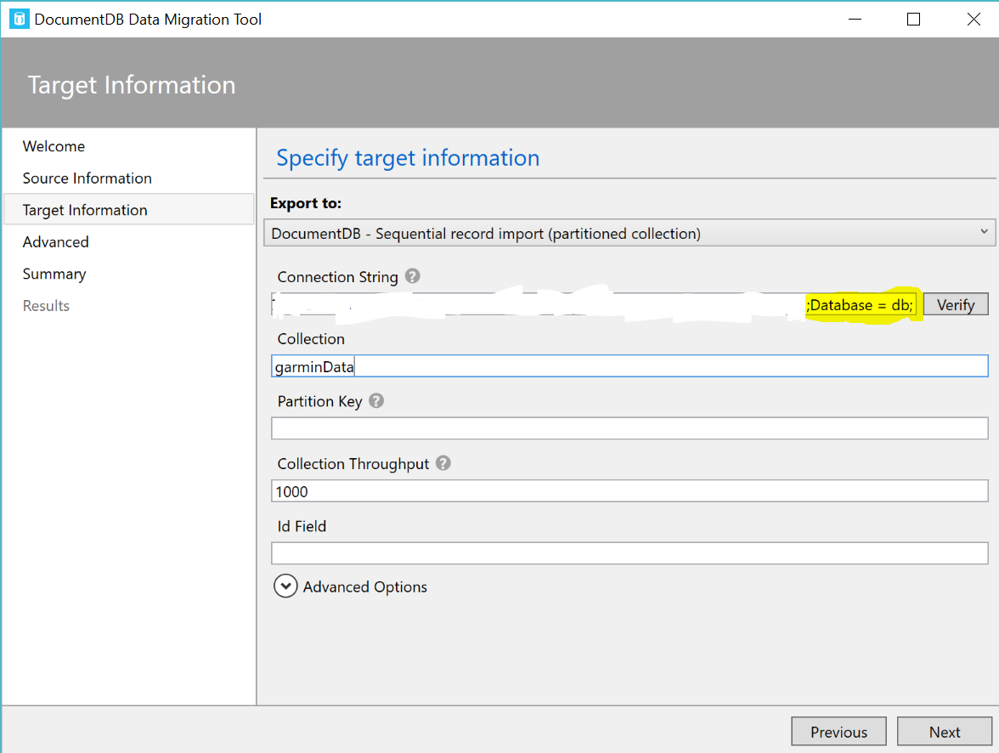

    3. Then upload your data. To see that our data has uploaded, we can go back to the portal, click query explorer and run the default query `SELECT * FROM c`:<br>
        

### Set the Index and understand Query language for the Database
As discussed previously when I presented this solution at NDC Oslo I was using Azure Search on top of my Document DB for the bot to talk to and was performing calculations like average and max in code. Due to the nature of my data and the lack of string fields (with the exception of dates and virus fields which aren't really strings) it meant that I was better off querying the Document DB directly and not using Azure search, especially since the data in DocDB was only updated once an hour.

As a result I needed to make some changes to the database index in the way I was working with strings to make it work.<br>

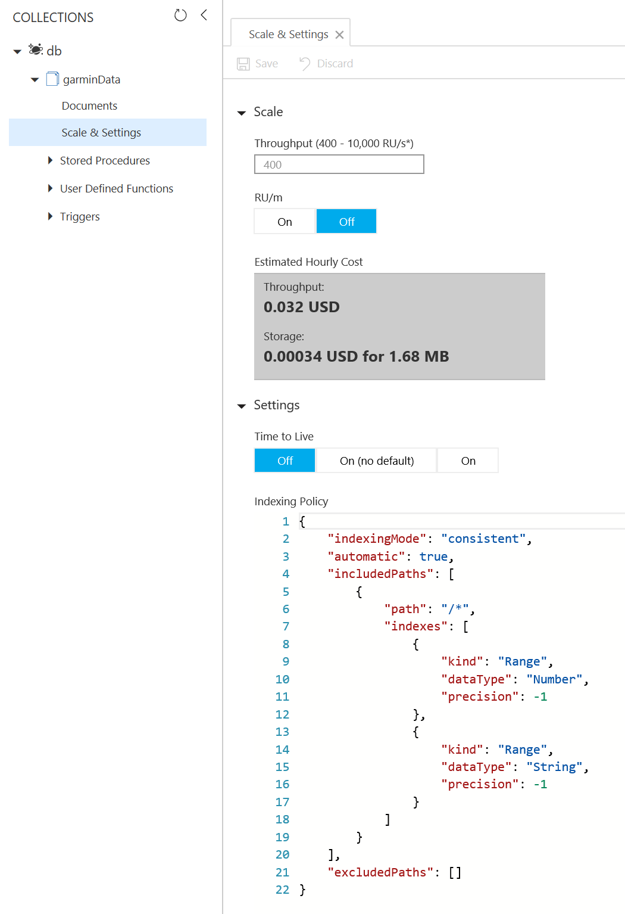<br>

I updated my indexing policy to move from hash indexes to range indexes for strings

``` javascript
{
    "indexingMode": "consistent",
    "automatic": true,
    "includedPaths": [
        {
            "path": "/*",
            "indexes": [
                {
                    "kind": "Range",
                    "dataType": "Number",
                    "precision": -1
                },
                {
                    "kind": "Range",
                    "dataType": "String",
                    "precision": -1
                }
            ]
        }
    ],
    "excludedPaths": []
}
```
This enables me to perform queries like

``` javascript
SELECT AVG(c.distance) FROM c where (c.day = "Saturday") and ((c.dateLogged >= "2016-01-01T00:00:00.0000000Z") and (c.dateLogged < "2017-01-01T00:00:00.0000000Z"))
```
to calculate the average distance that I travelled on Saturday last year

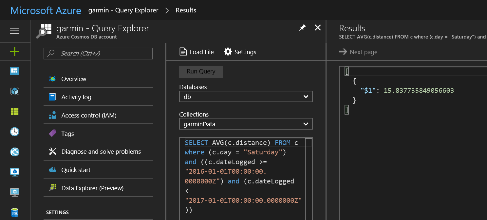<br>

You can read more about [Azure Cosmos DB indexing policies here](https://docs.microsoft.com/en-us/azure/cosmos-db/indexing-policies)

Also try the [Query playground](https://www.documentdb.com/sql/demo) and check out the [Document DB SQL reference](https://docs.microsoft.com/en-us/azure/cosmos-db/documentdb-sql-query-reference)

### Log in the Database the days when you are Sick

When you get sick you need to log this, I do this by logging into the Azure portal and using query explorer to run a query `SELECT * FROM c where c.dateLogged='2017-06-16T00:00:00.0000000Z'`<br>
Change the virus column to "Y" and click update.<br>
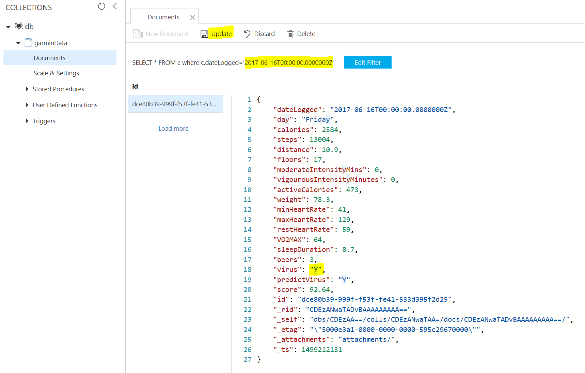<br>

After logging a number of sick days I recommend that you re-train your Azure ML model to improve it's accuracy in prediciting future virus and stress events.

## Automate all the things with Azure Functions

Now that you have set up the database with your garmin history the key is to automate the process of loading data moving forward. I found the best way to do this is with an Azure Timer function that runs once every hour and updates data from Garmin and Untappd and runs the data through the Azure ML web service to detect if I have a virus and score the prediction.

Check out the function quickstarts:<br>
[Create your first function using the Azure portal](https://docs.microsoft.com/en-us/azure/azure-functions/functions-create-first-azure-function)<br>
[Create your first function using Visual Studio (currently preview and C# only)](https://docs.microsoft.com/en-us/azure/azure-functions/functions-create-your-first-function-visual-studio) <br>
[Create your first function using the Azure CLI](https://docs.microsoft.com/en-us/azure/azure-functions/functions-create-first-azure-function-azure-cli) <br>

For the purpose of demonstration I'm going to show how to setup this function using the Azure Portal

1. Create a new Javascript Timer Trigger running once an hour<br>
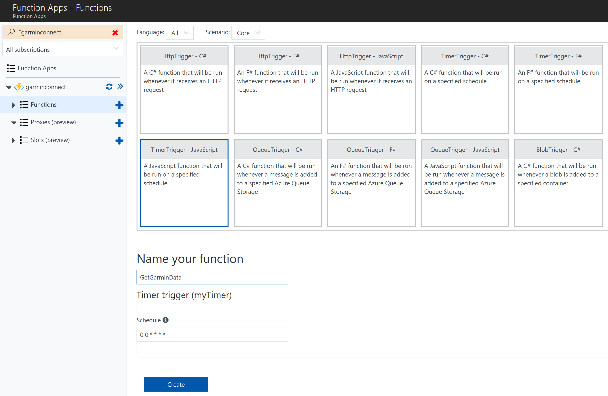<br>
2. Populate the function code inside [index.js](./CheckGarminData/index.js)<br>
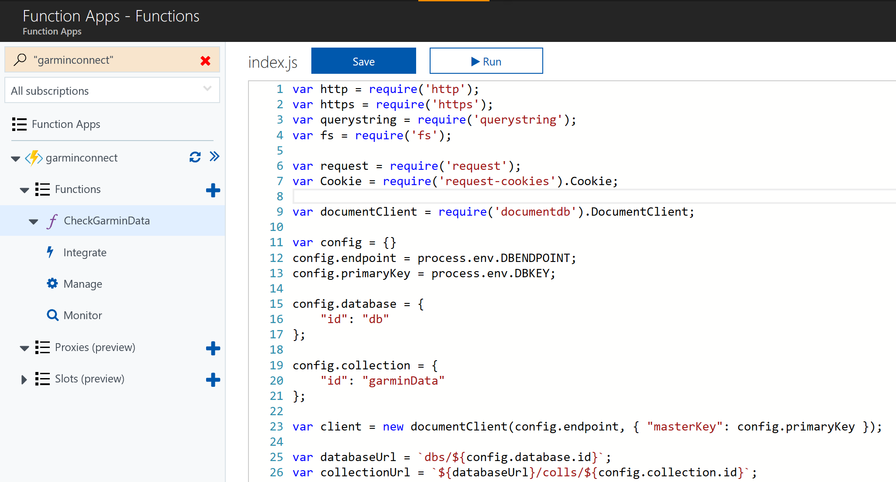<br>
3. Go to platform settings at the top level of the function and set application settings<br>
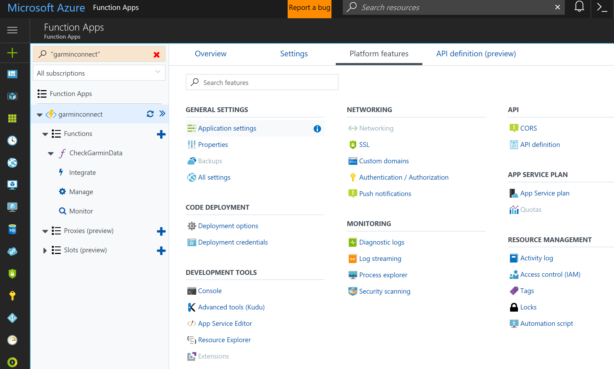<br>
4. Update the application settings for the function with your key values<br>
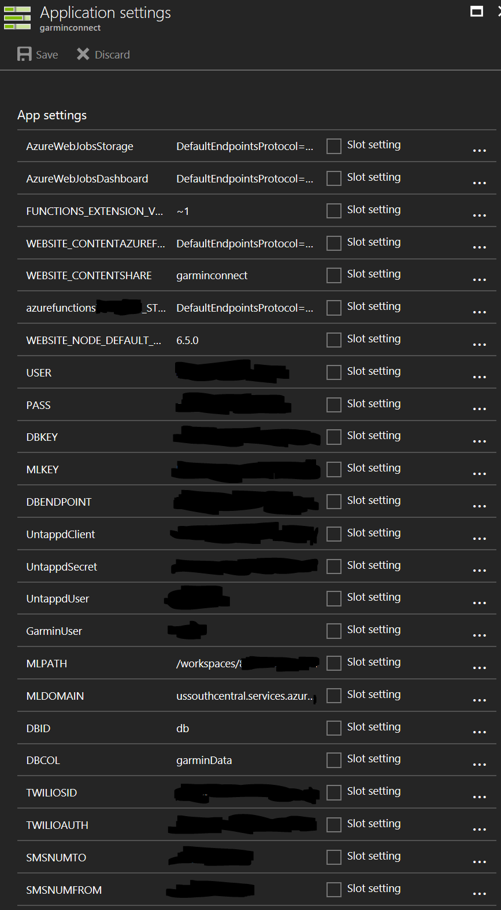<br>

``` javascript
USER // garmin user email address
PASS // password for garmin connect
DBKEY // Document DB Key
MLKEY // Azure ML studio web service key
DBENDPOINT=https://[your doc db name].documents.azure.com:443/
UntappdClient // If you are counting beers this is your Untappd API from https://untappd.com/api/docs/v3
UntappdSecret // Your Untappd Secret
UntappdUser // this is your untappd username
GarminUser // this is your garmin username
MLPATH=/workspaces/[your key]/execute?api-version=2.0&details=true // this is you Azure ML path
MLDOMAIN=ussouthcentral.services.azureml.net // your location may be different if you chose to deploy in another region
DBID=db // document DB database name
DBCOL=garminData // document DB collection name
TWILIOSID // for sending SMS https://www.twilio.com/sms this is your service ID
TWILIOAUTH // your twilio service auth key
SMSNUMTO // the phone number to send the sms to including country code e.g. +64
SMSNUMFROM // the phone number to send the sms from assuming you have purchased a number
```

5. From platform features select 'Advanced Tools(Kudu)'<br>
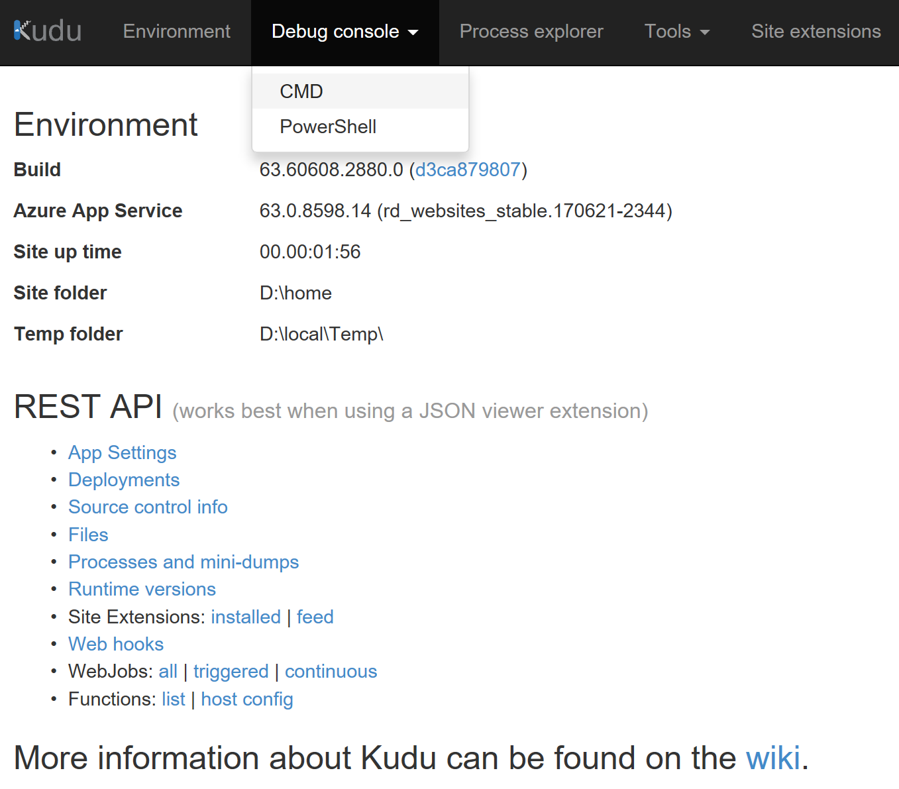<br>

6. On the 'Debug Console' CMD navigate to wwroot<br>
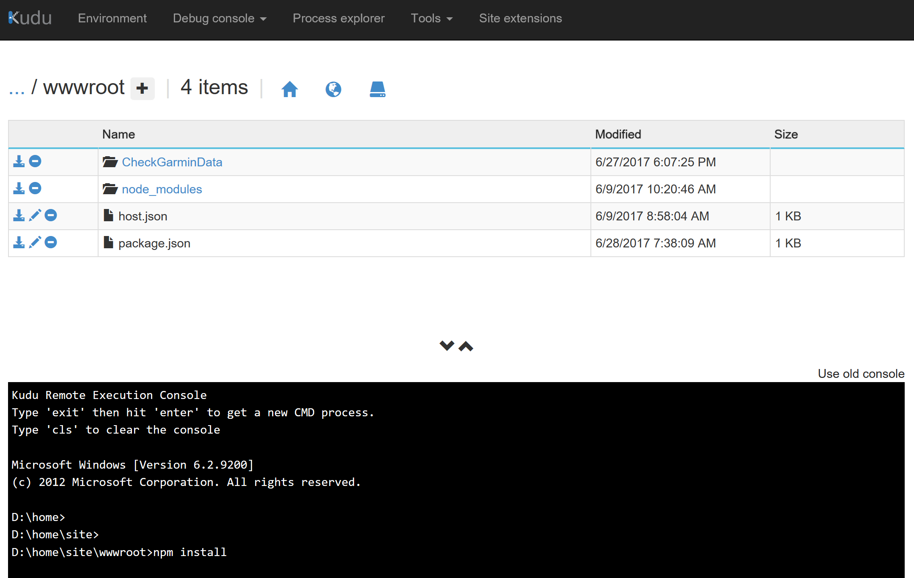<br>

Run an npm install [package name] --save on the following packages:

``` javascript
var http = require('http');
var https = require('https');
var querystring = require('querystring');
var fs = require('fs');
var request = require('request');
var Cookie = require('request-cookies').Cookie;
var documentClient = require('documentdb').DocumentClient;
var twilio = require('twilio');
```

7. Now you can test your function and monitor that it has been running<br>
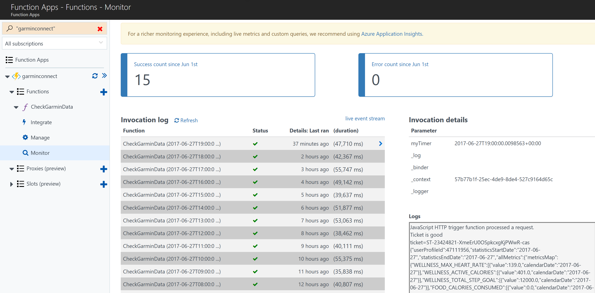<br>

Also check out [Continuous deployment for Azure Functions](https://docs.microsoft.com/en-us/azure/azure-functions/functions-continuous-deployment)

Below is a description of what is going on inside the function:

Map the latest values extracted from the wellness object from garmin connect to the document DB object.
Weight and VO2MAX come from future calls

``` javascript
var garminData = JSON.parse(good5);

docObj.day = dayNm[nd.getDay()];

var mm = garminData.allMetrics.metricsMap;

docObj.dateLogged=nd.yyyymmdd()+'T00:00:00.0000000Z';
docObj.calories = extractVal(mm.COMMON_TOTAL_CALORIES);
docObj.steps = extractVal(mm.WELLNESS_TOTAL_STEPS);
docObj.distance =parseFloat((extractVal(mm.WELLNESS_TOTAL_DISTANCE)/1000).toFixed(1)); 
// convert distance from m to km and fix to 1 decimal place
docObj.floors = extractVal(mm.WELLNESS_FLOORS_ASCENDED);
                                    
docObj.moderateIntensityMins = extractVal(mm.WELLNESS_MODERATE_INTENSITY_MINUTES);
docObj.vigourousIntensityMinutes= extractVal(mm.WELLNESS_VIGOROUS_INTENSITY_MINUTES);
docObj.activeCalories= extractVal(mm.WELLNESS_ACTIVE_CALORIES);

//docObj.weight": 0.0,
docObj.minHeartRate=extractVal(mm.WELLNESS_MIN_HEART_RATE);
docObj.maxHeartRate=extractVal(mm.WELLNESS_MAX_HEART_RATE);
docObj.restHeartRate=extractVal(mm.WELLNESS_RESTING_HEART_RATE);
//docObj.VO2MAX": 0,
docObj.sleepDuration=parseFloat((extractVal(mm.SLEEP_SLEEP_DURATION)/60/60).toFixed(1)); 
// convert sleep duration in seconds to hours to 1 decimal place

```
From the activities call check the last 30 days as VO2MAX is only recorded when exercising with heart rate and it is assumed that you don't exercise everyday but have exercised in the last 30 days. Get the last value as your current VO2MAX.

``` javascript
// get the last VO2MAX reading from the last 30 days
g.get("https://connect.garmin.com/modern/proxy/userstats-service/activities/all/"+process.env.GarminUser+"?fromDate="+backThirty.yyyymmdd()+"&untilDate="+d.yyyymmdd()).then(function(good6){
        context.log(good6);

        try {
            var activityData = JSON.parse(good6);
            // get the last VO2MAX value in the dataset as the most recent one
            docObj.VO2MAX= activityData.allMetrics.metricsMap.ACTIVITY_VO2_MAX[activityData.allMetrics.metricsMap.ACTIVITY_VO2_MAX.length-1].value;
        } catch (error) {
            context.error(error);
        }
```
The way I get my weight into garmin is via myfitnesspal from some blue tooth fitness scales. Weight isn't logged everyday. I get the most recent weight from 1 week ago to today and grab the first weight as the most recent. Weight is divided by 1000 to get it into kg and set to one decimal place.

``` javascript
g.get("https://connect.garmin.com/modern/proxy/userprofile-service/userprofile/personal-information/weightWithOutbound/filterByDay?from="+lastWeek.getTime()+"&until="+d.getTime()+"&_=1496970141638").then(function(good7){
        context.log(good7);

        try {
            var weightData = JSON.parse(good7);
            docObj.weight= parseFloat((weightData[0].weight/1000).toFixed(1));
        } catch (error) {
            context.error(error);
        }
```
Calling user checkins returns the last 25 beers that have been checked in on Untappd. Check the checkin date and time. If it is greater than the day being checked and less than the next day count the beer and add the tally to the object DB document.
``` javascript
// get the beer tally for the day from untappd after I get access to the api
g.get("https://api.untappd.com/v4/user/checkins/"+process.env.UntappdUser+"?client_id="+process.env.UntappdClient+"&client_secret="+process.env.UntappdSecret).then(function(good8){
    context.log(good8);
    var beerCount=0;
    try {
        var untappdData = JSON.parse(good8);
        if (untappdData && untappdData.response && untappdData.response.checkins && untappdData.response.checkins.items) {
            var beers = untappdData.response.checkins.items.forEach(function(checkin){
                //"Sun, 25 Jun 2017 23:52:42 +0000" stored in GMT time

                var chkD = new Date(checkin.created_at); 

                // use the offset for date adjustment from GMT time
                var nd = new Date(chkD.getTime() - (minms*chkD.getTimezoneOffset()));
                var objD = new Date(docObj.dateLogged);

                if ((+chkD>+objD)&&(+chkD<(+objD+dms))){
                    // compare the time in mili seconds to count beers that ocurred after the dateLogged but before dateLogged + 1 day  
                    beerCount++;
                }

            });
            docObj.beers = beerCount;
        }
        
    }
```
After the document is updated from the data sources call the Azure ML web service with the trained model and use it to predict if I have a virus or not and score the response as a degree of confidence. Once I have the document ready to go query the document DB to see if a document already exists for that day, if it does replace it, if it doesn't create it. At this point I also send an SMS Message (sample shown below) using [Twilio](https://www.twilio.com/sms) if the system detects that I have a virus or has confidence less than 65% that I don't have a virus. I log a field to ensure that I don't send multiple sms messages on the same day.

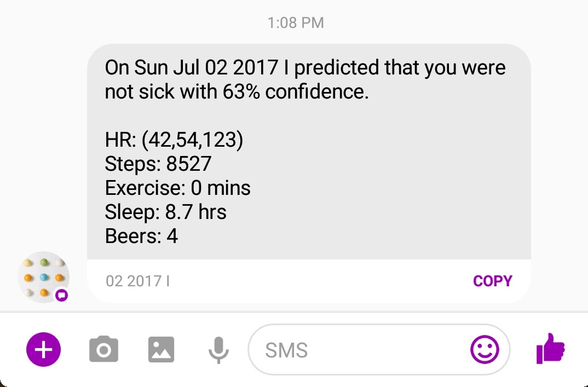


``` javascript
//This is the data that needs to be passed to the Azure ML web service.
function buildFeatureInput(context){
    var data = {
    "Inputs": {
    "input1": {
    "ColumnNames": ["dateLogged","day","sleepDuration","activeCalories","floors","maxHeartRate","minHeartRate","moderateIntensityMins","restHeartRate","calories","distance","steps","vigourousIntensityMinutes","VO2MAX","weight","beers","virus"],
    "Values": [ [nd.yyyymmdd()+"T00:00:00Z", docObj.day, docObj.sleepDuration, docObj.activeCalories, docObj.floors, docObj.maxHeartRate, docObj.minHeartRate, docObj.moderateIntensityMins,docObj.restHeartRate,docObj.calories,docObj.distance, docObj.steps,docObj.vigourousIntensityMinutes,docObj.VO2MAX, docObj.weight,docObj.beers,docObj.virus], ]    
    },
    },
    "GlobalParameters": {}
    }
    getPred(data,context);
}

function getPred(data,context) {
    var dataString = JSON.stringify(data)

    var host = process.env.MLDOMAIN
    var path = process.env.MLPATH
    var method = 'POST'
    var api_key = process.env.MLKEY
    var headers = {'Content-Type':'application/json', 'Authorization':'Bearer ' + api_key};
    
    var options = {
    host: host,
    port: 443,
    path: path,
    method: 'POST',
    headers: headers
    };
    
    var reqPost = https.request(options, function (res) {
        
        res.on('data', function(d) {

            try {
                // check the scored label and probability back from Azure ML and load it into the object
                var scoreData = JSON.parse(d);
                docObj.predictVirus = scoreData.Results.output1.value.Values[0][13]; // navigate to the prediction
                docObj.score = parseFloat((scoreData.Results.output1.value.Values[0][14]*100).toFixed(2)); // navigate to the confidence score and turn it into a percentage
            } catch (error) {
                context.error(error);
            }

            client.queryDocuments(
            collectionUrl,
            'SELECT * FROM c where c.dateLogged = "'+docObj.dateLogged+'"'
            ).toArray((err, results) => {
                if (err) reject(err)
                else {
                    if (results.length==0){
                        // there isn't a document for this day create it

                        if ((docObj.predictVirus=='Y')||(docObj.score>smsThreshold)){
                            sendSickSMS(context); // send this if the prediciton is that I have a virus or my confidence is less than 65% and an sms hasn't already been sent for this day.
                            docObj.sentSMS = 'Y';
                        }

                        client.createDocument(collectionUrl, docObj, (err, created) => {
                            if (err) reject(err)
                            
                            context.done();
                        });
                    }
                    else {
                        for (var queryResult of results) {
                            let resultString = JSON.stringify(queryResult);
                            context.log(`\tQuery returned ${resultString}`);

                            if (((docObj.predictVirus=='Y')||(docObj.score>smsThreshold)) && (!queryResult.sentSMS)){
                                sendSickSMS(context); // send this if the prediciton is that I have a virus or my confidence is less than 65% and an sms hasn't already been sent for this day.
                                docObj.sentSMS = 'Y';
                            }
                            else if (queryResult.sentSMS) {
                                // we have already sent an sms for this day pass that through to the new document
                                docObj.sentSMS = queryResult.sentSMS;
                            }

                            replaceDocument(queryResult);
                        }
                        context.done();
                    }
                }
            });
        });
    });
    
    // Would need more parsing out of prediction from the result
    reqPost.write(dataString);
    reqPost.end();
    reqPost.on('error', function(e){
    context.error(e);
    });

}

function replaceDocument(document) {
    let documentUrl = `${collectionUrl}/docs/${document.id}`;
    
    docObj.id = document.id;
    return new Promise((resolve, reject) => {
        client.replaceDocument(documentUrl, docObj, (err, result) => {
            if (err) reject(err);
        });
    });
};

```

## Build the model with Power BI and Cortana Integration

Now that you have the data inside of Document DB if you have a Power Bi subscription you can connect directly to the Document DB datasource and build reports and Cortana integration directly into your data.

1. Create the Document DB Data Source in the Power BI desktop client:

    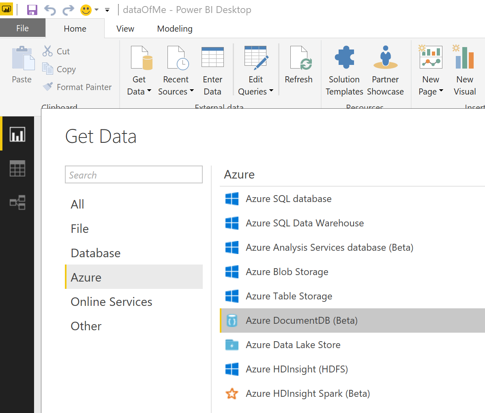<br>

    Expand the document record and select the columns that you wish to bring in

    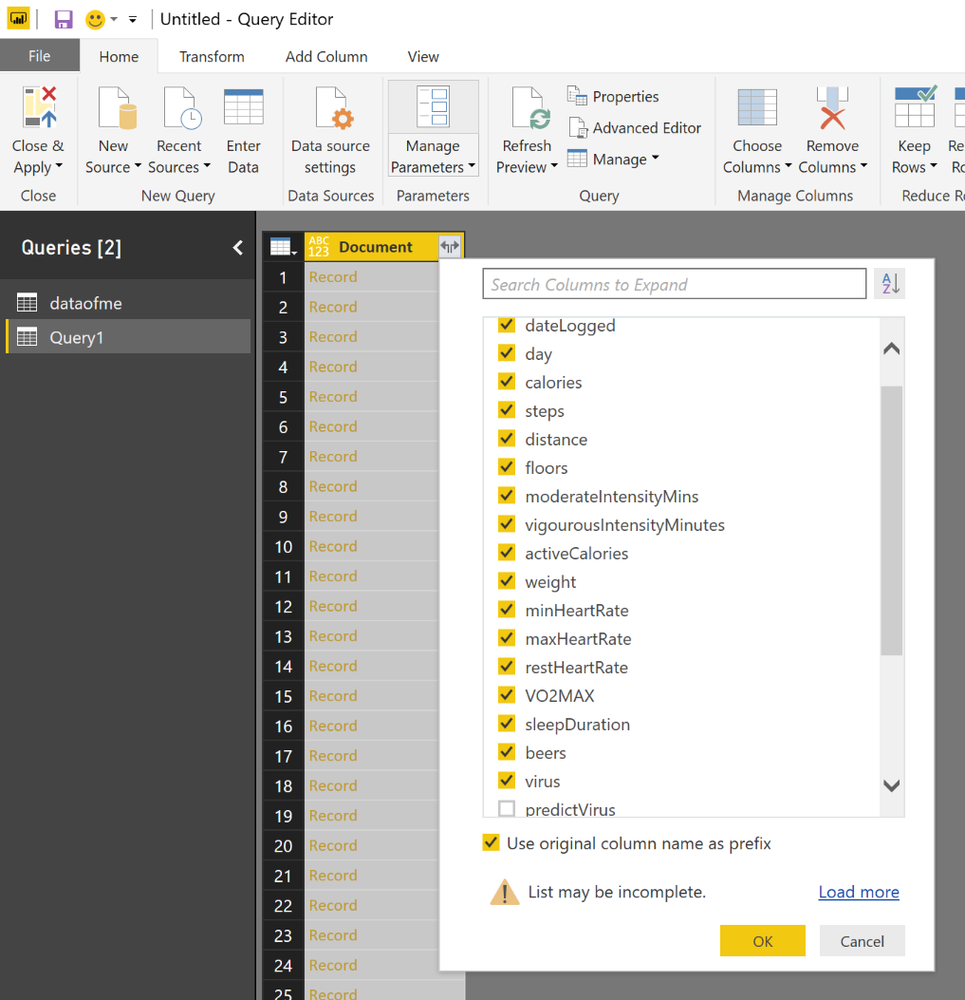<br>

    Change the file types to match the type from the Document DB

    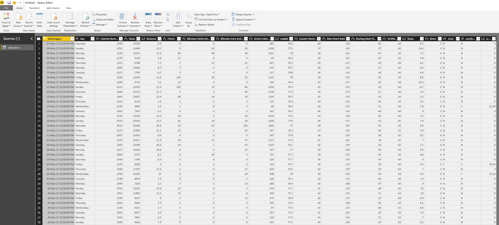<br>

2. Create some calulated columns

    1. Create a few new columns: 
    ``` javascript
        date = dataofme[dateLogged].[Date] // DateLogged translates to DateTime
        dayName = FORMAT(dataofme[dateLogged],"ddd")
        dayNumber = WEEKDAY(dataofme[dateLogged],2) // the 2 sets week for Monday -> Sunday
        month = dataofme[dateLogged].[Month]
        monthNumber = dataofme[dateLogged].[MonthNo]
        year = dataofme[dateLogged].[Year]
    ```

    2. Set Sort by Column:

    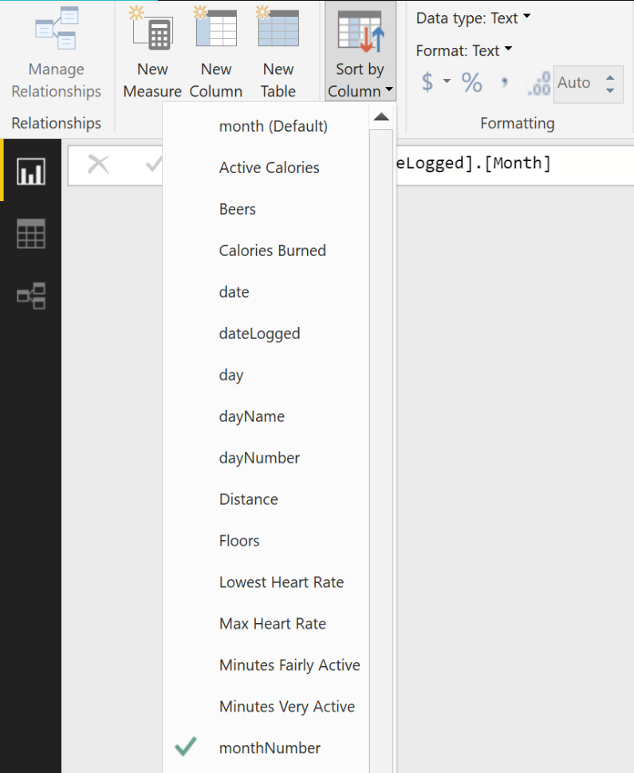

    Select month and sort by monthNumber<br>
    Select dayName and sort by dayNumber

3. Create some custom report pages for Cortana - what you call the report page will become the trigger inside of Cortana e.g. if the page is called Distance Travelled and I go into cortana on windows and start typing distance travelled in 2016 I will be shown the page I have created filtered by year 2016. I can filter by whatever I set in the page level filters.

    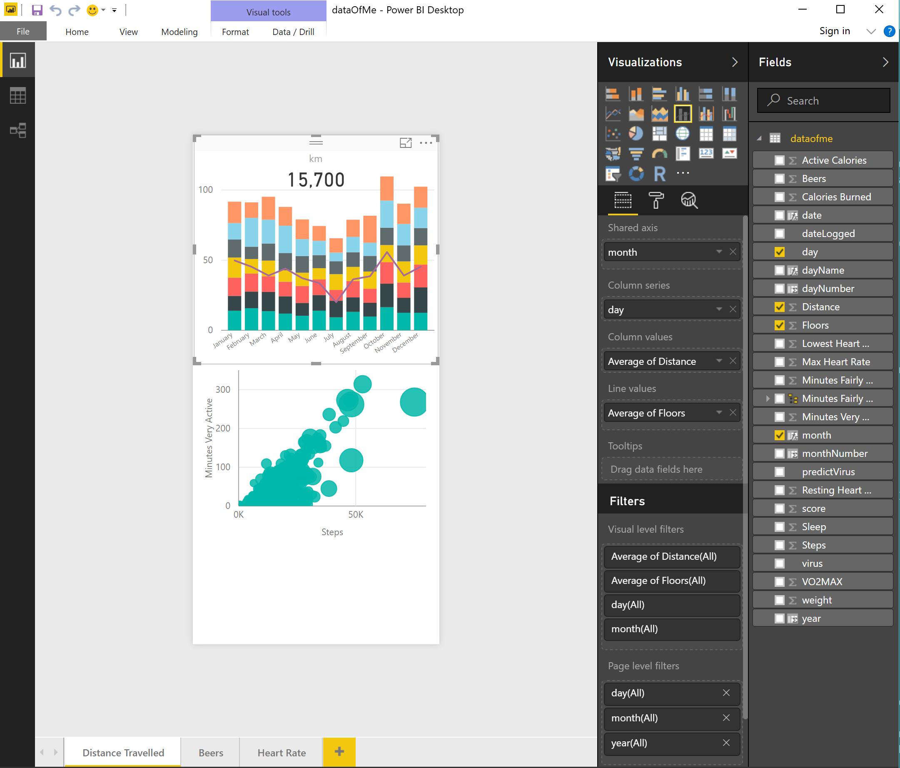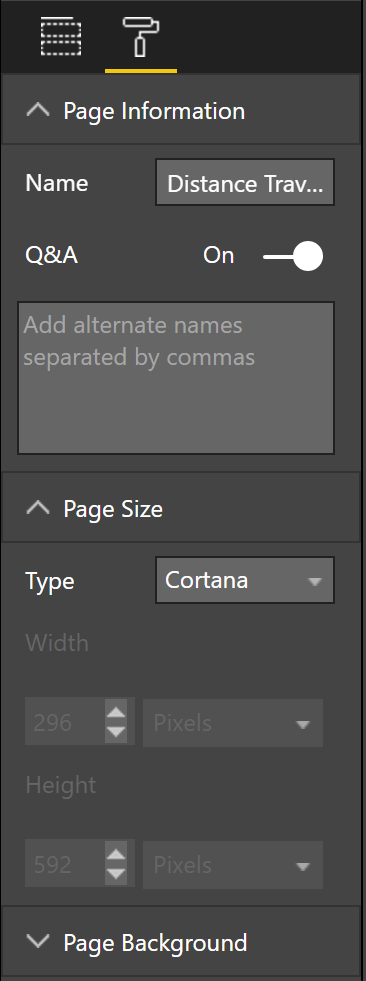<br>

I have included [my Power BI Template](./powerBI/dataOfMe.pbit) so you can open this and follow the steps below to publish without needing to create your own report:

1. Open my [my Power BI Template](./powerBI/dataOfMe.pbit) - Click cancel when it prompts for the Document DB account key

2. Click 'Edit Queries' - 'Advanced Editor'

    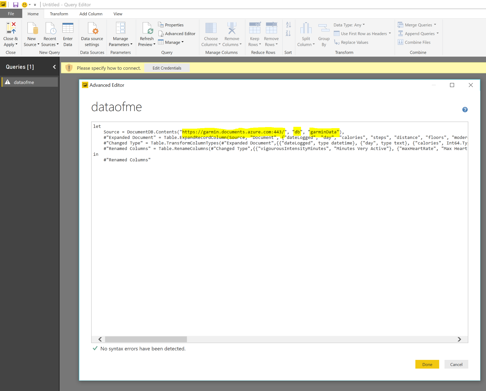

    Update the DocumentDB.Contents("[enter your document db URL here]", "[db name]", "[collection name]") to match your Document DB and save the file.

3. Click 'Edit Credentials' and insert your Document DB key - Click 'Close & Apply' then 'Refresh' and the data should load

    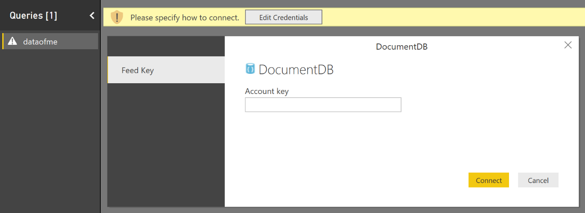

4. Click "publish" then select "My workspace"

    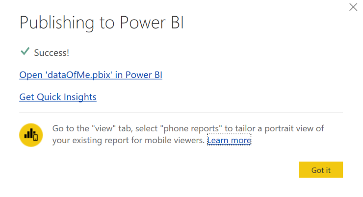<br>

5. Click to open 'dataOfMe.pbix' in Power BI
6. On the bottom left hand side on the dataset menu - click the three ... next to 'dataOfMe'

    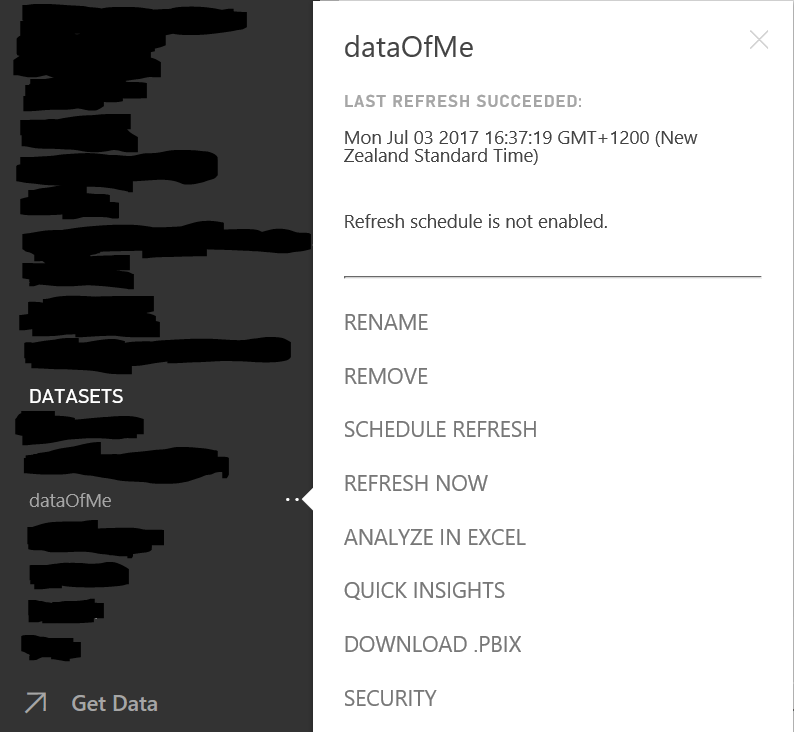<br>

    Click on 'Schedule Refresh'

7. Enter your Document DB credentials 

    <br>

8. Setup the Refresh Schedule

    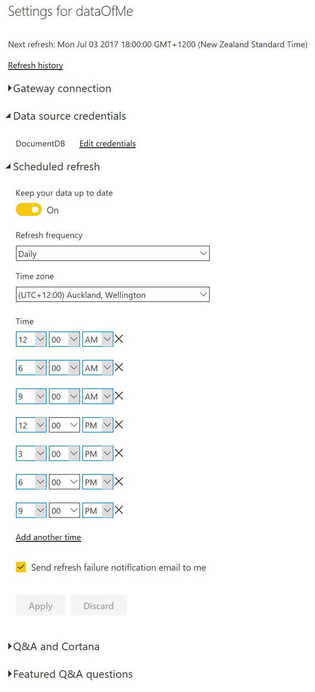<br>

9. Turn on Cortana Integration and setup some sample questions

    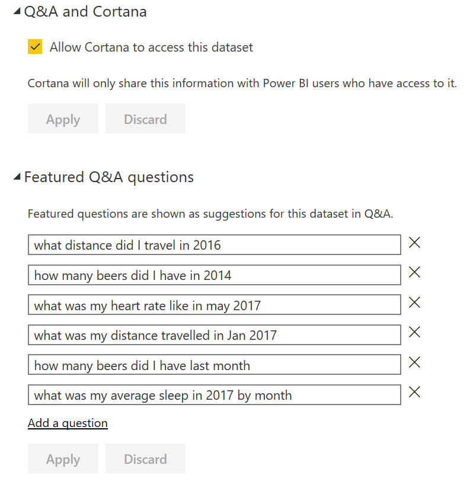<br>

10. Enable the O365 service in Cortana

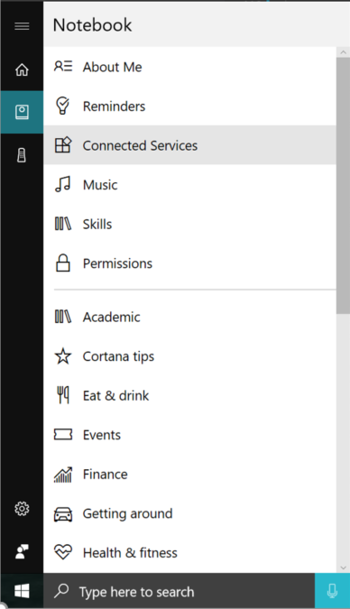
<br>

11. Q&A needs to be enabled on each page in the report this should already been done

    Go into the dataOfMe report and pin the live tile to a new dashboard


    Do this for each page in the report


11. Test the dashboard and the cortana integration


## Build the Bot

### Setting Up LUIS

1. Log into [luis.ai](https://www.luis.ai/) and import [my Garmin Queries](./luis/GarminQueries.json)


2. Click 'Train your app'
3. Click 'Assign Key' - you can create a new key in the azure portal if you choose the free tier you get 5 calls per sec and 10k calls per month.<br>
<br>
4. Publish to 'Production' endpoint<br>
<br>
5. Test the service<br>
<br>
6. Look at the features - these words are interchangable for each other<br>
<br>

There is a couple of ways that you can work with langauge translation my collegue Alyssa has worked on a [bot Translator](https://github.com/alyssaong1/BotTranslator) uses Microsoft's Translator API to translate the user's utterance into any language you want, and then pass it into LUIS for natural language processing. The reason for doing this is that [LUIS currently supports 12 languages](https://docs.microsoft.com/en-us/azure/cognitive-services/luis/luis-concept-language-support), so a workaround for lanaguages that aren't natively supported is to convert the user's utterance into a supported language, then feed that into LUIS to determine the user's intent.

Another way to approach the problem is that if the questions are simple you can add the words you are interested in detecting as features so that they can be intrepreted.
e.g. if I translate 'How many beers did I have in 2016' to Norwegian I get 'Hvor mange øl hadde jeg i 2016' - if I add the norwegian word for beer to my beer feature and test my service I get the correct entity matches.

<br>

The more you use the bot the more it learns and creates suggested utterances for you to create. At any point you can create new utterances and re-train and re-deploy your LUIS model. 

<br>

### Integrating LUIS into the Bot

The bot I will demonstrate is built in Node.js. If you are new to bot building check out [aka.ms/botcourse](http://aka.ms/botcourse), specifically the sections about setting up a node project, using cards and using dialogs. 

The bot has a single dialog set to ask questions of my data in a natural language.

It has a [queryHelper.js](./bot/queryHelper.js) file that takes the response from LUIS.ai and turns it into a documentDB search query.

In the Terminal Window - npm install each of the node packages that we use inside our bot

``` javascript
    var http = require('http');
    var https = require('https');
    var querystring = require('querystring');
    var fs = require('fs');
    var request = require('request');
    var Cookie = require('request-cookies').Cookie;
    var documentClient = require('documentdb').DocumentClient;
    var twilio = require('twilio');
```

Setup a new .env file as follows:

``` javascript
    # Bot Framework Variables
    MICROSOFT_APP_ID=
    MICROSOFT_APP_PASSWORD=

    # LUIS MODEL Key
    LUIS_MODEL_URL=https://westus.api.cognitive.microsoft.com/luis/v2.0/apps/[appID]?subscription-key=[subscription id]&timezoneOffset=[offset in minutes]&verbose=true&spellCheck=true&

    DOCUMENTDB_HOST=https://[your doc db name].documents.azure.com:443/
    DOCUMENTDB_KEY=[your doc db key]
    DOCUMENTDB_DATABASE=[your doc db name]
    DOCUMENTDB_COLLECTION=[your collection name]

    PORT=3978
```
    Set up the LUIS model and use that to handle the input and try and match to one of our intents.

``` javascript
    var bot = new builder.UniversalBot(connector);
    server.post('/api/messages', connector.listen());

    var model = process.env.LUIS_MODEL_URL; // includes timezone offset and spell check
    var recognizer = new builder.LuisRecognizer(model);
    var intents = new builder.IntentDialog({ recognizers: [recognizer] }).onDefault(DefaultReplyHandler);
    bot.dialog('/', intents);

    var DefaultReplyHandler = function (session) {
        session.endDialog(
            'Sorry, I did not understand "%s". Use sentences like "How far did I run this year?", "How many beers did I drink on weekends in January?", "What was my lowest heart rate this month?", "How much sleep did I get last night?")',
            session.message.text);
    };
```

When a question is asked by the user it gets interpreted by LUIS and returned as matching intents.


``` javascript
    intents.matches('GetGarminData', [
        function (session, args, next) {
            // interpret the intent from LUIS

            queryHelper.buildDateQuery(builder.EntityRecognizer, args.entities, (err, searchQueryStr) => {
                if (err) {
                    console.log(`Building search query failed with ${err}`);
                } else {

                    client.queryDocuments(
                    collectionUrl,
                    searchQueryStr
                    ).toArray((err, results) => {
                        if (err) console.log(err);
                        else {
                            if (results.length==0){
                                // there isn't a document returned for this query
                                console.log(`no document was returned from query ${searchQueryStr}`);
                                session.endConversation(`Opps, something went wrong, please try again`);
                            }
                            else if (results.length==1) {
                                // we have a single result for average count or sum
                                // or this could be in response to a Min / Max or last time query

                                queryHelper.buildResponseQuery(builder.EntityRecognizer, args.entities, results[0], (err, valStr) => {
                                    if (err) {
                                        console.log(`Building response failed with ${err}`);
                                        session.endConversation(`Opps, something went wrong, please try again`);
                                    } else {
                                        session.endConversation(valStr);
                                    }
                                });
                            }
                            else if (results.length>1) {
                                // we have multiple documents returned check for virus or prediction and build carousel

                                queryHelper.buildResponseCards(builder.EntityRecognizer, args.entities, results, builder, session, (err, msgCard) => {
                                    if (err) {
                                        console.log(`Building response failed with ${err}`);
                                        session.endConversation(`Opps, something went wrong, please try again`);
                                    } else {
                                        // display the carousel
                                        session.send(msgCard).endDialog();
                                    }
                                });
                            }
                        }
                    });
                }
            });

            return next({ response: args });
        },function (session, results) {
            // perform the search and return response

            session.endDialog();
        }
    ]);
```

Note that our error handling for this example simply logs the error to console - in a real world bot we would want to be more involved in 
our error handling. 

Finally, let's test our bot out. Either [deploy your bot to an Azure web app](https://docs.microsoft.com/en-us/bot-framework/deploy-bot-overview) and fill in the .env variables in the portal. I will demonstrate the bot working in the bot framework emulator, but if deployed, this bot could be [enabled on several different channels like Skype, Slack and Facebook Messenger](https://docs.microsoft.com/en-us/bot-framework/portal-configure-channels)<br>

Running in the Bot Emulator:<br>


Running as a bot on Facebook Messenger on my phone:<br>


I have enjoyed collecting data and building this passion project out over the last four years. There is a lot of moving parts but it certainly helps me now stay healthy and gain insight into my personal state of well being. I'm facinated to learn how you have taken this work and applied it to your own data and your own data and your own health journey.